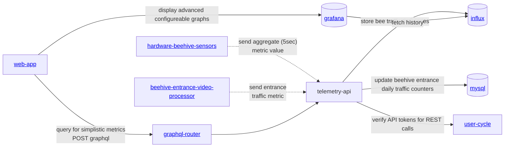

# gratheon / telemetry-api 📊
Backend service responsible for logging metrics into timeseries database (influx).
Expected to run in the cloud and receive IoT data from beehives.

Main goal and feature is [described in Notion](https://gratheon.notion.site/Telemetry-API-5d60632841534620ba56d1bb296af98b)

### Metrics examples
- beehive weight (over time)
- temperature
- humidity
- CO2 levels
- atmospheric pressure
- bee traffic (in/out) at the hive entrance
- audio noise volume
- vibrations
- wind speed


## URLs
| URL | Description |
| --- | --- |
| http://telemetry.gratheon.com | Production |
| http://localhost:8600 | Local dev |

## API
| URL | Method | Description |
| --- | --- | --- |
| /metric/:hiveId | POST | Send metrics to be stored in the database. Needs API tokens that are verified against user-cycle service

```json
{
  "fields": {
    "temperature": 25.5
  }
}

```

|
| /graphql | POST | Federated graphql API endpoint. Used to fetch data from web-app with authorization checks in graphql-router |

## Installation & development
Checkout grafana first from https://github.com/Gratheon/grafana
Start those pods to have influx with docker-compose
- Open http://localhost:5300/
- login into influxdb
- open Load Data -> API Tokens -> Generate API Token so that telemetry-api could write data to influxdb
- Change `INFLUXDB_TOKEN` in docker-compose.dev.yml and set it to the token you generated

Then start telemetry api:
```bash
make start
```

## Architecture


