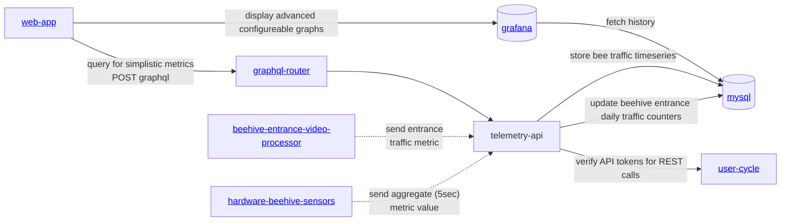

# gratheon / telemetry-api 📊
Backend service responsible for logging metrics into timeseries database (influx).
Expected to run in the cloud and receive IoT data from beehives.

Main goal and feature is [described in Notion](https://gratheon.notion.site/Telemetry-API-5d60632841534620ba56d1bb296af98b)

### Metrics
- ✅ temperature
  - TODO: add 3d temperature endpoint `/metrics/temperature`
- ✅ beehive weight (over time)
- ✅ humidity

#### TODO
- CO2 levels
- atmospheric pressure
- bee traffic (in/out) at the hive entrance
- audio noise volume
- vibrations
- wind speed


## URLs
| URL | Description |
| --- | --- |
| http://telemetry.gratheon.com | Production |
| http://localhost:8600 | Local dev |


## APIs
This service provides two types of APIs
- [GraphQL API](https://gratheon.com/docs/API/GraphQL%20APIs) - most flexible and type safe for web-app, not versioned
- [REST API](https://gratheon.com/docs/API/REST%20APIs) - more of a legacy API, intended for IoT devices, versioned


## Installation & development
Then start telemetry api:
```bash
just start
```

## Architecture

We are NOT using timeseries DB (influx, clickhouse) because we don't have manpower to maintain multiple storage engines at this time.
So we're relying on MySQL for ease of management, even though its not as efficient.



## License

This project is **dual-licensed**:

- **[AGPL v3](LICENSE-AGPL.md)** - For open source use:
    - ✅ You can use, modify, and distribute the software
    - ✅ Source code is freely available
    - ⚠️ If you modify and host a public instance, you must share your modifications
    - ⚠️ Any derivative work must also be licensed under AGPL v3

- **[Commercial License](LICENSE-COMMERCIAL.md)** - For enterprise customers who need:
    - 🏢 On-premise deployment without source disclosure
    - 🔧 Custom modifications without copyleft obligations
    - 📞 Priority support and SLA guarantees