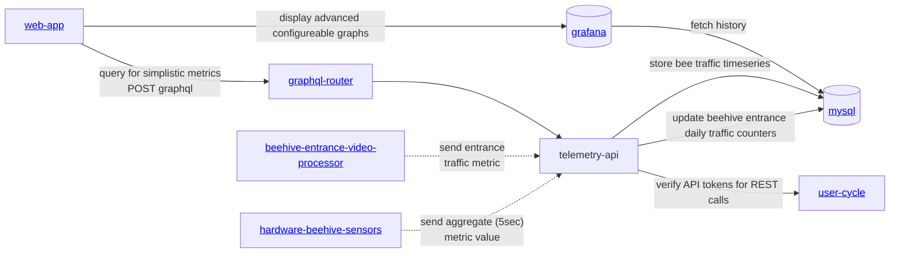

# gratheon / telemetry-api 📊
Backend service responsible for logging metrics into timeseries database (influx).
Expected to run in the cloud and receive IoT data from beehives.

Main goal and feature is [described in Notion](https://gratheon.notion.site/Telemetry-API-5d60632841534620ba56d1bb296af98b)

### Metrics
- ✅ temperature
  - TODO: add 3d temperature endpoint `/metrics/temperature`
- ✅ beehive weight (over time)
- ✅ humidity

#### TODO
- CO2 levels
- atmospheric pressure
- bee traffic (in/out) at the hive entrance
- audio noise volume
- vibrations
- wind speed


## URLs
| URL | Description |
| --- | --- |
| http://telemetry.gratheon.com | Production |
| http://localhost:8600 | Local dev |


## APIs
This service provides two types of APIs:

### GraphQL API
Most flexible and type-safe for web-app, not versioned. Available at `/graphql`.

#### Query Operations
- `temperatureCelsius(hiveId, timeRangeMin)` - Get temperature metrics
- `humidityPercent(hiveId, timeRangeMin)` - Get humidity metrics
- `weightKg(hiveId, timeRangeMin)` - Get weight metrics
- `weightKgAggregated(hiveId, days, aggregation)` - Get aggregated weight data (DAILY_AVG, DAILY_MAX, DAILY_MIN)
- `entranceMovementToday(hiveId, boxId)` - Get today's bee movement summary
- `entranceMovement(hiveId, boxId, timeFrom, timeTo)` - Get bee movement history
- `populationMetrics(hiveId, days)` - Get population metrics (bee count, drone count, varroa mites)

#### Mutation Operations
- `addMetric(hiveId, fields)` - Add IoT sensor metrics (temperature, humidity, weight)
- `addPopulationMetric(hiveId, fields, inspectionId, timestamp)` - Add population data

See [schema.graphql](schema.graphql) for full API specification.

### REST API
Legacy API intended for IoT devices, versioned. Available at `/iot/v1/metrics`.

**POST /iot/v1/metrics**
- Accepts single metric or array of metrics
- Requires Bearer token authentication
- Supports batch operations (up to 1000 metrics per request)

Example:
```json
{
  "hiveId": "123",
  "timestamp": 1234567890,
  "fields": {
    "temperatureCelsius": 25.5,
    "humidityPercent": 65.0,
    "weightKg": 45.2
  }
}
```

## Database Schema

The service uses MySQL with three main tables:

### beehive_metrics
Stores IoT sensor data (temperature, humidity, weight)
```sql
- id (INT, auto increment)
- hive_id (VARCHAR(50))
- temperature_celsius (FLOAT)
- humidity_percent (FLOAT)
- weight_kg (FLOAT)
- time (TIMESTAMP)
```

### entrance_observer
Stores bee entrance movement data from video processing
```sql
- id (INT, auto increment)
- hive_id (VARCHAR(50))
- box_id (VARCHAR(50))
- bees_out (FLOAT)
- bees_in (FLOAT)
- net_flow (FLOAT)
- avg_speed_px_per_frame (FLOAT)
- p95_speed_px_per_frame (FLOAT)
- stationary_bees_count (INT)
- detected_bees (INT)
- bee_interactions (INT)
- time (TIMESTAMP)
```

### population_metrics
Stores manual inspection data about hive population
```sql
- id (INT, auto increment)
- hive_id (VARCHAR(50))
- inspection_id (VARCHAR(50))
- bee_count (INT)
- drone_count (INT)
- varroa_mite_count (INT)
- time (TIMESTAMP)
```

See [migrations/](migrations/) for full schema definitions.

## Testing

This project uses Jest for integration testing.

### Running Tests

```bash
# Run tests locally (requires running MySQL instance)
npm test

# Run tests in Docker (includes all dependencies)
npm run test:docker

# Start test environment for manual testing
npm run test:docker:start

# Stop test environment
npm run test:docker:stop
```

### Test Coverage

Tests are located in `test/integration/` and cover:
- **GraphQL API** (`graphql.test.ts`) - Query/mutation validation and error handling
- **REST API** (`iot-metrics.test.ts`) - Input validation, authentication, batch operations
- **Entrance Movement** (`entrance-movement.test.ts`) - Bee traffic metrics
- **Population Metrics** (`population-metrics.test.ts`) - Hive population data
- **Data Generation** (`generate-population-data.test.ts`) - Bulk data insertion

Tests include:
- Input validation and error cases
- Authentication and authorization
- Bulk data operations (up to 8,640 metrics per month)
- Time range queries and aggregations

## Installation & Development

Start telemetry API:
```bash
just start
```

Or run locally without Docker:
```bash
just run
```

## Architecture

We are NOT using timeseries DB (influx, clickhouse) because we don't have manpower to maintain multiple storage engines at this time.
So we're relying on MySQL for ease of management, even though its not as efficient.



## License

This project is **dual-licensed**:

- **[AGPL v3](LICENSE-AGPL.md)** - For open source use:
    - ✅ You can use, modify, and distribute the software
    - ✅ Source code is freely available
    - ⚠️ If you modify and host a public instance, you must share your modifications
    - ⚠️ Any derivative work must also be licensed under AGPL v3

- **[Commercial License](LICENSE-COMMERCIAL.md)** - For enterprise customers who need:
    - 🏢 On-premise deployment without source disclosure
    - 🔧 Custom modifications without copyleft obligations
    - 📞 Priority support and SLA guarantees