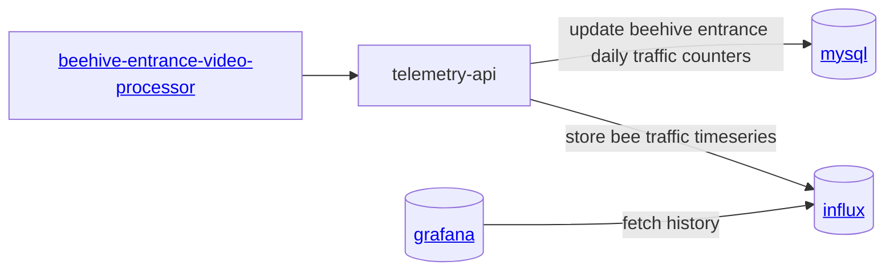

# telemetry-api
Backend service to log beehive timeseries data

## Architecture

```mermaid
flowchart LR
	telemetry-api --"update beehive entrance daily traffic counters"--> mysql[(<a href="https://github.com/Gratheon/mysql">mysql</a>)]


beehive-entrance-video-processor[<a href="https://github.com/Gratheon/beehive-entrance-video-processor">beehive-entrance-video-processor</a>] --> telemetry-api


	telemetry-api --"store bee traffic timeseries" --> influx[(<a href="https://github.com/Gratheon/grafana">influx</a>)]

	grafana[(<a href="https://github.com/Gratheon/grafana">grafana</a>)] --"fetch history"--> influx
```
